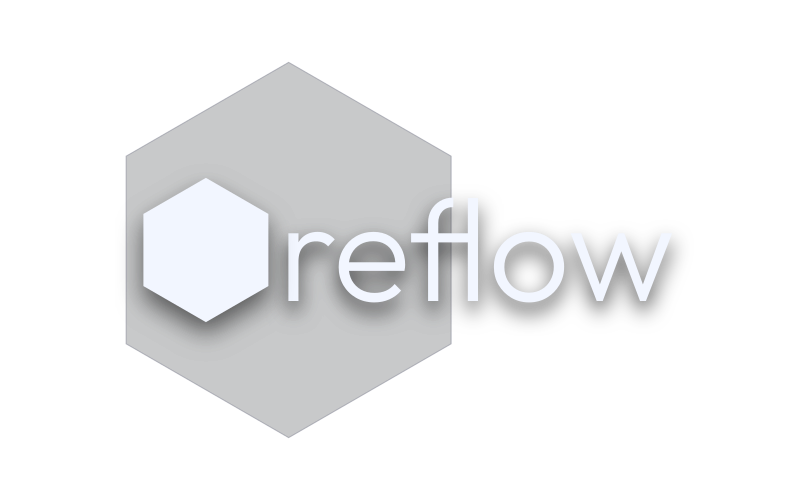
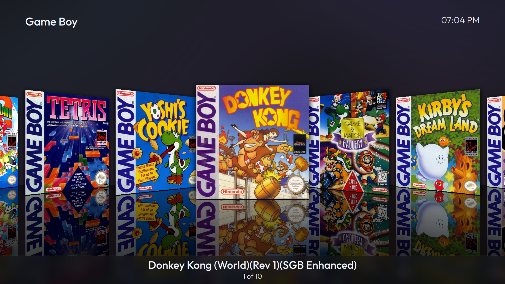
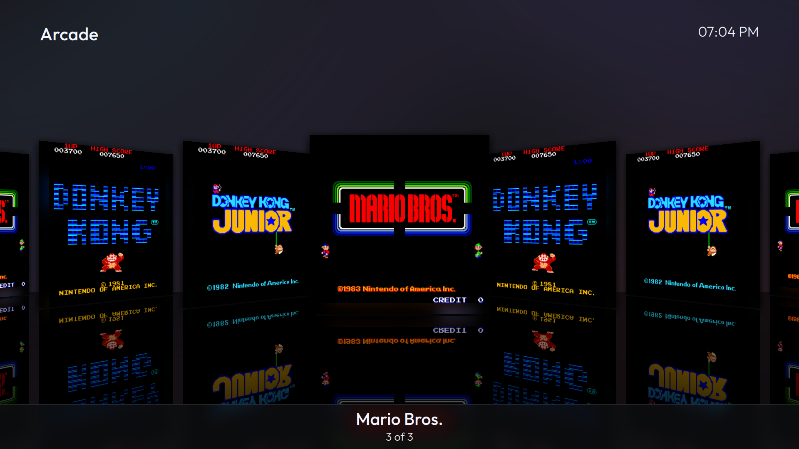
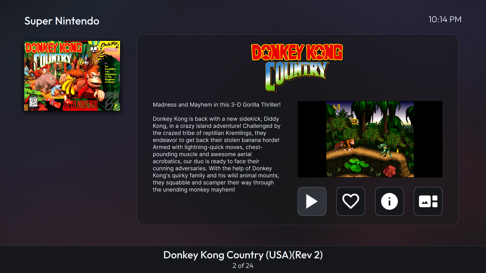
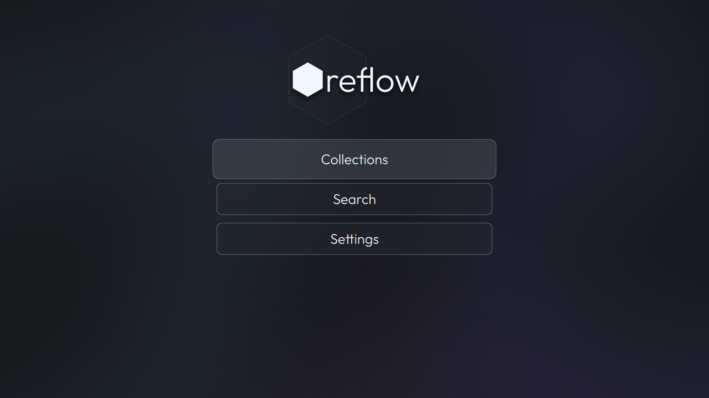
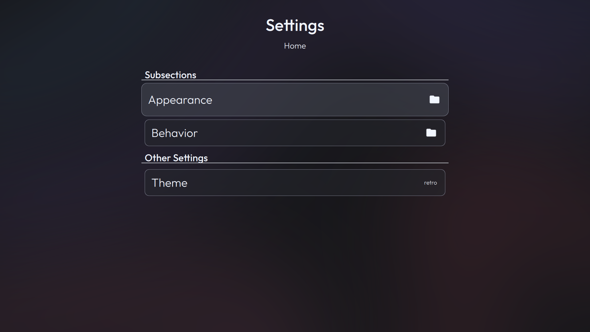

reflow is a theme for [Pegasus Frontend](http://pegasus-frontend.org/), inspired by the likes of [WiiFlow](https://github.com/Fledge68/WiiFlow_Lite), [HexFlow](https://github.com/VitaHEX-Games/HexFlow-Launcher), and other coverflow-like launchers.

My goal with reflow is to create a theme that is greatly customizable yet easy to use, much like my other theme, [Library.](https://github.com/Fr75s/library) Right now, however, it is very early in development.

Website coming soon™

---

# Installation

To install this theme, first download this repository. Once downloaded, move the contents of this repository to a folder in [your themes folder.](https://pegasus-frontend.org/docs/user-guide/installing-themes/) reflow should now be installed.

Optionally, to save space, you can remove the SAFELY_REMOVABLE folder inside the assets folder. Note that you'll need to do this every time you update or reinstall reflow.

# Issues & Translations

If you find any issues, feel free to open up an issue in this repository. You may also want to contact me elsewhere (I tend to be active most in [The Pegasus Discord](https://discord.gg/KTtzP6y)), in which case I will likely respond (but issues are the most helpful way to get your problem seen).

While I would gladly accept your translations, due to the rapid ongoing development, your translations are likely to be outdated somewhat quickly. As a result, if you'd like to translate this theme, please wait until this theme becomes more stable. (If you want to translate my other theme, [Library](https://github.com/Fr75s/library), go ahead! And if you really want to create a translation, you can use the same instructions there to make one for this theme, as the localization system is identical.)

# Screenshots

